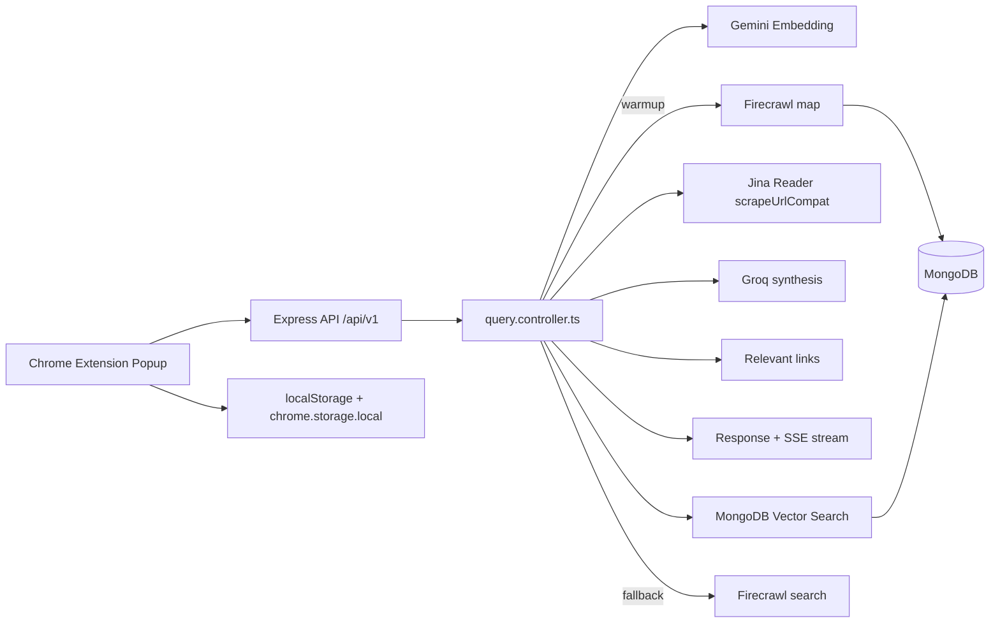

# 🌐 Universal WebAI - Complete Documentation

**A hybrid RAG Chrome extension that turns the website you are browsing into a searchable AI knowledge base.**

---

## Table of Contents

1. [What Universal WebAI Is](#what-universal-webai-is)
2. [Current Stack](#current-stack)
3. [Architecture Overview](#architecture-overview)
4. [Project Structure](#project-structure)
5. [Frontend Architecture](#frontend-architecture)
6. [Backend Architecture](#backend-architecture)
7. [Data Flow](#data-flow)
8. [API Reference](#api-reference)
9. [Environment Variables](#environment-variables)
10. [Setup](#setup)
11. [Performance Notes](#performance-notes)
12. [Logs and Troubleshooting](#logs-and-troubleshooting)

---

## What Universal WebAI Is

Universal WebAI is a universal AI chat assistant extension that attaches to any website you open.

It behaves like the website's own AI assistant: you ask in chat, and it answers using the website as a whole instead of only the page currently open in your tab.

It works by combining:

- semantic search with Gemini embeddings
- site mapping with Firecrawl
- page scraping with Jina Reader
- answer synthesis with Groq
- MongoDB Atlas Vector Search for retrieval

The system is designed for large institutional portals, dense documentation sites, and complex websites where users usually have to click through many layers just to find a single answer.

---

## Current Stack

### Frontend

- React 19.2.4
- Vite 8.0.1
- Chrome Extension APIs
- Tailwind CSS 3.4.19

### Backend

- Node.js + Express 5.2.1
- TypeScript 6.0.2
- Mongoose 9.3.3
- MongoDB driver 7.1.1
- Groq SDK 1.2.0

### AI and Retrieval

- Gemini Embedding 001 for text embeddings
- Groq `llama-3.1-8b-instant` for answer synthesis
- Groq fallback models configured through env vars
- Firecrawl map/search for site discovery
- Jina Reader for content scraping
- MongoDB Atlas Vector Search for semantic retrieval

---

## Architecture Overview



The important distinction in the current codebase is:

- Firecrawl is still used for mapping and search fallback
- Jina Reader is used for scraping page content
- Gemini is used only for embeddings
- Groq is used for final answer generation and link synthesis

---

## Project Structure

```text
Universal-WebAI-MAIN/
├── backend/
│   ├── src/
│   │   ├── index.ts
│   │   ├── db.ts
│   │   ├── models.ts
│   │   ├── scraper.ts
│   │   ├── controllers/
│   │   │   └── query.controller.ts
│   │   ├── routes/
│   │   │   └── query.routes.ts
│   │   └── services/
│   │       ├── ai.service.ts
│   │       └── web.service.ts
│   ├── package.json
│   └── tsconfig.json
├── frontend/
│   ├── src/
│   │   ├── App.jsx
│   │   ├── App.css
│   │   └── index.css
│   ├── manifest.json
│   └── package.json
├── README.md
└── COMPLETE_DOCUMENTATION.md
```

---

## Frontend Architecture

The popup lives in [frontend/src/App.jsx](frontend/src/App.jsx).

### What it does

- reads the active tab URL
- loads stored chat history for the current site
- sends questions to the backend
- parses SSE messages from the streaming endpoint
- renders the assistant bubble, progress tracker, and relevant links
- persists chat history per site in both localStorage and chrome.storage.local

### Important UI behavior

- The assistant message appears immediately when a question is sent.
- Streaming chunks update the message bubble as they arrive.
- Progress text is shown during mapping and evidence collection.
- Errors are converted into friendly feedback messages before being shown in chat.

### Main state groups

- `input` for the current question
- `messages` for chat history
- `loading` for request state
- `activeUrl` and `activeSiteKey` for the current site
- `siteStatus` for warmup state
- `tracker` for progress display

### Persistence behavior

The frontend stores chat history per site key and merges localStorage with chrome.storage.local when the popup opens again. That keeps conversations tied to the current domain while still surviving popup remounts.

---

## Backend Architecture

### Server entry point

[backend/src/index.ts](backend/src/index.ts) creates the Express server, enables JSON parsing, sets CORS for `http://localhost:5173` and Chrome extension origins, connects to MongoDB, and mounts the API routes under `/api/v1`.

### Database connection

[backend/src/db.ts](backend/src/db.ts) connects to MongoDB using `MONGO_URI`.

### Models

[backend/src/models.ts](backend/src/models.ts) stores two main collections:

- `websites` tracks whether a domain has been mapped
- `sitemaps` stores discovered URLs, titles, and embeddings

### Query controller

[backend/src/controllers/query.controller.ts](backend/src/controllers/query.controller.ts) is the main business-logic file.

It handles:

- URL normalization
- answer cache lookups
- warmup cache checks
- background mapping trigger
- question embedding generation
- vector search
- Firecrawl search fallback when vector confidence is low
- URL extraction with per-URL timeout
- Groq answer synthesis
- relevant-link selection
- JSON and SSE responses

The current query pipeline:

1. Normalize the current and base URL.
2. Return a cached answer if it exists.
3. Check whether the domain is already warm.
4. Start background mapping if needed.
5. Embed the question with Gemini.
6. Search MongoDB Atlas Vector Search.
7. Fall back to Firecrawl search if the vector match is weak.
8. Scrape the selected URLs with Jina Reader.
9. Combine the extracted context.
10. Synthesize the final answer with Groq.
11. Select the most relevant source URLs.
12. Return the response to the frontend or stream it via SSE.

### Web service

[backend/src/services/web.service.ts](backend/src/services/web.service.ts) is responsible for:

- `mapNewWebsite()` using Firecrawl `map()`
- batching embeddings for mapped links
- saving sitemap rows to MongoDB
- `vectorSearch()` with MongoDB Atlas Vector Search

Important details:

- Firecrawl mapping stays in place.
- Embeddings are created in small batches to reduce pressure on the embedding service.
- `vectorSearch()` currently returns the top candidate set used by the query controller.

### Scraper

[backend/src/scraper.ts](backend/src/scraper.ts) now uses Jina Reader for scraping.

Current behavior:

- build `https://r.jina.ai/${url}`
- optionally attach `Authorization: Bearer ${JINA_KEY}`
- GET the page
- normalize the markdown
- truncate each response to 3,000 characters per URL
- return the same `ExtractCompatResult` shape used downstream

Firecrawl remains in the project for mapping and search fallback only.

### AI service

[backend/src/services/ai.service.ts](backend/src/services/ai.service.ts) now uses:

- Gemini for embeddings only
- Groq for final answer synthesis
- Groq for relevant-link synthesis

It also includes:

- in-memory embedding cache
- short-answer extraction helpers for role/name questions
- prompt cleanup and fallback behavior
- a 4,000 character cap before the final Groq prompt is assembled

---

## Data Flow

### Query flow

1. The popup sends the current page URL and the question.
2. The backend normalizes the URL.
3. The backend checks whether the domain is already mapped.
4. If not mapped, it starts a background mapping job.
5. The question is embedded with Gemini.
6. MongoDB Vector Search returns the most relevant URLs.
7. If confidence is weak, the backend uses Firecrawl search fallback.
8. The selected URLs are scraped through Jina Reader.
9. The extracted content is combined into a context string.
10. Groq synthesizes the final answer.
11. Groq also helps choose relevant links from the provided sources.
12. The backend returns the answer, sources, and relevantLinks.

### Stream flow

When the SSE endpoint is used, the backend sends:

- stage events
- answer_chunk events
- result events
- error events

The frontend updates the tracker and assistant bubble as those events arrive.

---

## API Reference

### `POST /api/v1/query`

Request body:

```json
{
  "question": "Who is the director?",
  "currentPageUrl": "https://example.com/page",
  "baseUrl": "https://example.com/"
}
```

Response:

```json
{
  "answer": "Dr. Jane Doe is the director.",
  "sources": ["https://example.com/page", "https://example.com/"],
  "relevantLinks": ["https://example.com/about/team"]
}
```

### `POST /api/v1/query/stream`

Returns an SSE stream with the same result object, plus progress and chunk events.

### `POST /api/v1/site/warmup`

Starts or reports warmup status for the current domain.

### Response shape

The response generally contains:

- `answer`: the final synthesized text
- `sources`: every source URL used during extraction
- `relevantLinks`: a smaller set of the most relevant URLs

---

## Environment Variables

### Required or commonly used

```env
MONGO_URI=
PORT=5000
FIRECRAWL_KEY=
GEMINI_KEY=
GEMINI_EMBEDDING_MODEL=models/gemini-embedding-001
GROQ_API_KEY=
GROQ_ANSWER_MODEL=llama-3.1-8b-instant
GROQ_ANSWER_FALLBACK_MODELS=llama-3.1-70b-versatile
JINA_KEY=
```

Notes:

- `JINA_KEY` is optional.
- The current code also accepts `GORQ_KEY` as a fallback for the Groq client.
- `GEMINI_KEY` remains required for embeddings.

---

## Setup

### Backend

```bash
cd backend
npm install
npm run build
npm run start
```

### Frontend

```bash
cd frontend
npm install
npm run build
```

Load the frontend folder as an unpacked Chrome extension from `chrome://extensions`.

### Development tips

- If the popup is not showing the correct tab, reload the extension after opening the page you want to test.
- If the backend is restarted, refresh the popup so the SSE connection reconnects cleanly.
- If the site has not yet been mapped, the first query may be slower while the background job is still running.

---

## Performance Notes

The current implementation includes a few important optimizations:

- answer caching per domain and normalized question
- warmup caching per domain
- extraction caching per URL
- embedding caching in memory
- batched site-mapping embeddings
- truncated Jina responses per URL
- truncated context before Groq synthesis
- memoized message list rendering in the popup

These changes reduce repeated work without changing the core user flow.

---

## Logs and Troubleshooting

### Useful log tags

- `[QUERY]` query lifecycle and timings
- `[MAP]` mapping and embedding progress
- `[JINA]` scrape requests and failures
- `[AI]` Groq and embedding activity

### Common problems

- If you see a 404-like answer result, the page likely did not contain enough usable information.
- If scraping is slow, check Jina Reader response size and network access.
- If embeddings fail, check `GEMINI_KEY` and the MongoDB connection.
- If final synthesis fails, check the Groq key and model name.
- If source links look wrong, verify the page text actually contains the answer and that the domain was mapped successfully.

### Debug checklist

1. Confirm backend is running on port 5000.
2. Confirm MongoDB is connected.
3. Confirm `GEMINI_KEY`, `FIRECRAWL_KEY`, and Groq env vars are set.
4. Confirm `JINA_KEY` is present if you want Jina auth.
5. Confirm the extension is loading the correct active tab URL.

---

## Summary

Universal WebAI currently works as:

- a React Chrome extension popup
- a Node.js/TypeScript backend
- a MongoDB-backed semantic retrieval system
- a Firecrawl-mapped, Jina-scraped, Groq-synthesized RAG assistant

The codebase is structured so that the frontend stays lightweight and the backend does the heavy lifting.
